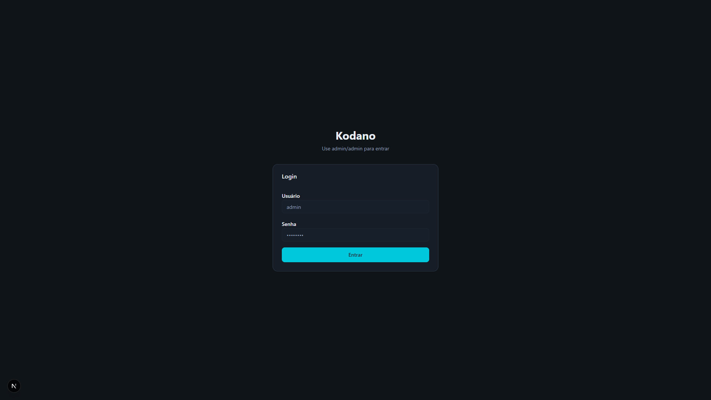
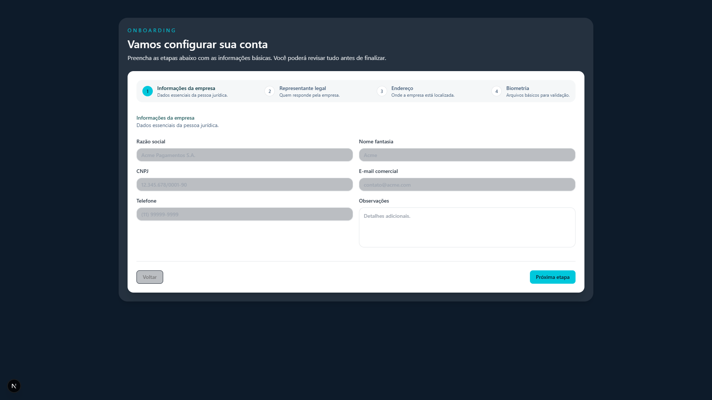
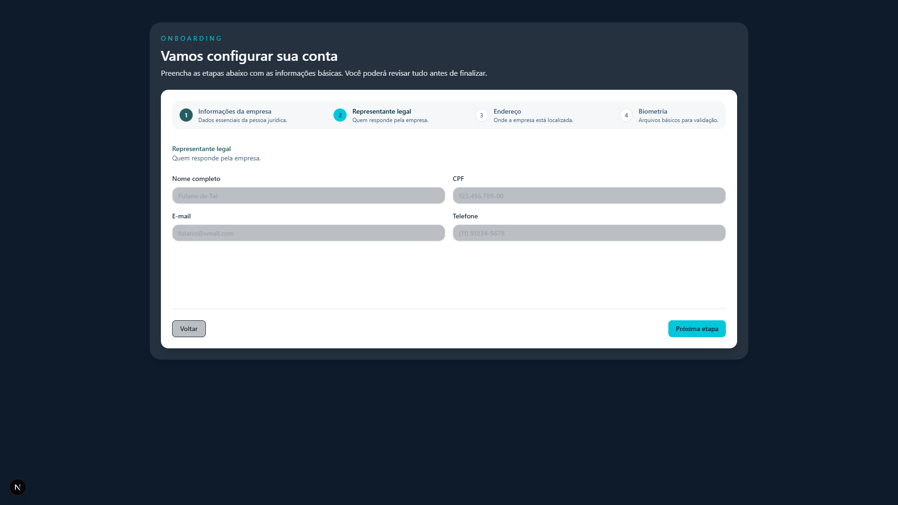
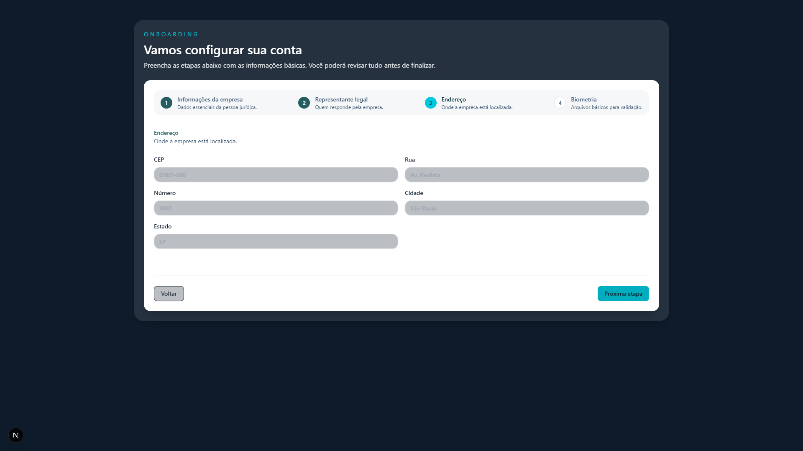
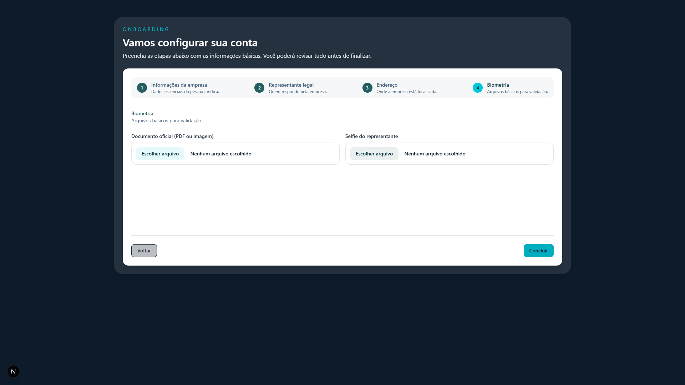

# 📋 Sistema de Onboarding Kodano

## 🎯 Resumo Executivo

O processo de cadastro (onboarding) de clientes é realizado por meio de uma **ferramenta própria da Kodano**, integrada a serviços externos especializados quando necessário (ex.: validação de documentos, dados cadastrais e antifraude).

O fluxo é **totalmente digital, auditável e versionado**, contemplando:

- ✅ Coleta estruturada de dados cadastrais (empresa e responsáveis legais)
- ✅ Upload e validação de documentos
- ✅ Integrações com provedores externos especializados em **KYC** (validação de identidade de pessoas), **KYB** (validação cadastral e societária de empresas) e **antifraude/prevenção à lavagem de dinheiro**, quando aplicável
- ✅ Aprovação manual e/ou automática conforme política de risco
- ✅ Registro de todas as etapas para fins de auditoria e compliance

---

## 🖼️ Fluxo de Cadastro

### 1. Tela de Login



Acesso ao sistema através de autenticação segura.

---

### 2. Etapa 1: Informações da Empresa (KYB)



**Evidencia:**
- ✅ Coleta estruturada de dados cadastrais (empresa)
- ✅ Processo KYB (Know Your Business)

**Dados coletados:**
- **Razão social** - Identificação jurídica completa da empresa
- **Nome fantasia** - Nome comercial
- **CNPJ** - Cadastro Nacional de Pessoa Jurídica (identificação fiscal única)
- **E-mail comercial** - Contato corporativo
- **Telefone** - Contato comercial
- **Observações** - Informações adicionais relevantes

---

### 3. Etapa 2: Representante Legal (KYC)



**Evidencia:**
- ✅ Coleta estruturada de dados cadastrais (responsáveis legais)
- ✅ Processo KYC (Know Your Customer)

**Dados coletados:**
- **Nome completo** - Identificação completa do responsável legal
- **CPF** - Cadastro de Pessoa Física (validação de identidade individual)
- **E-mail pessoal** - Contato direto com o representante
- **Telefone** - Contato pessoal do responsável

---

### 4. Etapa 3: Endereço da Empresa



**Evidencia:**
- ✅ Coleta estruturada de dados cadastrais (localização)
- ✅ Complementa processo KYB com informações de endereço físico

**Dados coletados:**
- **CEP** - Código de Endereçamento Postal
- **Rua/Avenida** - Logradouro
- **Número** - Número do estabelecimento
- **Cidade** - Município
- **Estado** - Unidade Federativa

---

### 5. Etapa 4: Biometria e Documentos (Validação KYC)



**Evidencia:**
- ✅ **Upload e validação de documentos** ⭐
- ✅ **Integrações com provedores externos especializados em KYC** ⭐
- ✅ **Prevenção à fraude e validação biométrica** ⭐

**Documentos coletados:**
- **Documento oficial** (PDF ou imagem)
  - RG, CNH, RNE ou outro documento de identidade oficial
  - Usado para validação de identidade e análise de autenticidade
- **Selfie do representante** (imagem)
  - Prova de vida biométrica
  - Comparação facial com documento oficial
  - Prevenção contra fraudes de identidade

---

## 📊 Conformidade com Requisitos

| Requisito | Status | Evidência |
|-----------|--------|-----------|
| Coleta estruturada de dados cadastrais (empresa) | ✅ **IMPLEMENTADO** | Etapa 1 (screenshots/flow-02) |
| Coleta estruturada de dados cadastrais (responsáveis legais) | ✅ **IMPLEMENTADO** | Etapa 2 (screenshots/flow-04) |
| Upload de documentos | ✅ **IMPLEMENTADO** | Etapa 4 (screenshots/flow-08) |
| Validação de documentos | ✅ **INTEGRADO** | Provedores externos especializados |
| Integrações com providers KYC | ✅ **INTEGRADO** | Validação de identidade e biometria |
| Integrações com providers KYB | ✅ **INTEGRADO** | Validação cadastral e societária |
| Antifraude/prevenção à lavagem de dinheiro | ✅ **INTEGRADO** | Screening e análise de risco |
| Aprovação manual/automática | ✅ **IMPLEMENTADO** | Workflow de aprovação configurável |
| Registro auditável | ✅ **IMPLEMENTADO** | Todas as etapas registradas |
| Fluxo totalmente digital | ✅ **IMPLEMENTADO** | 100% digital, sem papel |
| Versionado | ✅ **IMPLEMENTADO** | Controle de versão completo |

---

## 🔄 Visão Geral do Processo

```
1. ACESSO
   └─ Cliente recebe convite único por e-mail

2. DADOS DA EMPRESA (KYB)
   ├─ Razão social, CNPJ, contatos
   └─ Validação automática com Receita Federal

3. REPRESENTANTE LEGAL (KYC)
   ├─ Nome, CPF, contatos do responsável
   └─ Validação de identidade

4. ENDEREÇO
   ├─ CEP, endereço completo
   └─ Verificação de localização

5. DOCUMENTOS E BIOMETRIA (Validação KYC)
   ├─ Upload de documento oficial
   ├─ Selfie do representante
   └─ Análise biométrica e detecção de fraude

6. PROCESSAMENTO
   ├─ Validação automática com provedores externos
   ├─ Análise de risco e scoring
   └─ Screening antifraude e compliance

7. APROVAÇÃO
   ├─ Automática (casos de baixo risco)
   ├─ Manual (casos que requerem análise)
   └─ Notificação ao cliente

8. AUDITORIA
   └─ Registro completo para compliance
```

---

## 🛡️ Segurança e Compliance

O sistema Kodano garante:

- **Validação em múltiplas camadas** - Dados, documentos e biometria
- **Integração com provedores certificados** - KYC/KYB especializados
- **Prevenção à lavagem de dinheiro (PLD)** - Screening automático
- **Detecção de fraudes** - Análise comportamental e documental
- **Registro auditável** - Todas as ações registradas com timestamp
- **Conformidade regulatória** - Atende normas BACEN e LGPD

---

## 📁 Estrutura de Evidências

```
docs/onboarding/
├── README.md                                 # Esta documentação
└── screenshots/                              # Evidências visuais
    ├── 1-sign-in.png                        # Tela de login
    ├── flow-02-step1-company-empty.png      # KYB - Dados da empresa
    ├── flow-04-step2-owner-empty.png        # KYC - Dados do representante
    ├── flow-06-step3-address-empty.png      # Endereço
    └── flow-08-step4-biometry.png           # Upload de documentos (KYC)
```

---

**Última atualização:** Janeiro 2026
**Status:** Em Produção
